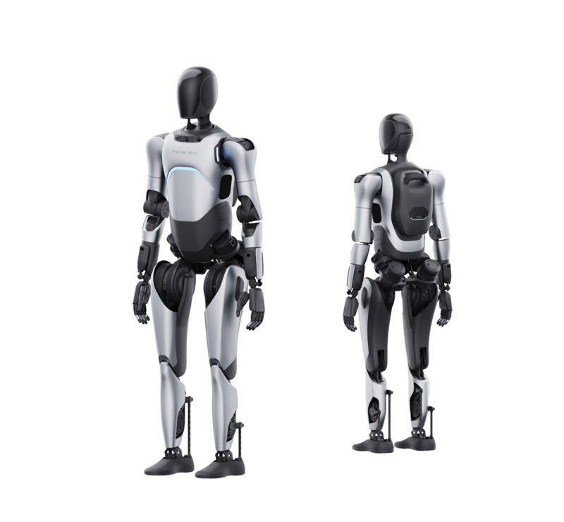

English | [中文](README.zh_CN.md)

## Introduction

Raise A2 is a modular, high-freedom humanoid robot developed and open-sourced by Agibot. This project contains the reinforcement learning training code for Raise A2, which can be used with the deployment framework for real machine and simulation walking debugging, or to import other robot models for training.



## Code Execution

### Install Dependencies
1. Create a new Python 3.8 virtual environment:
   - `conda create -n myenv python=3.8`.
   - Activate the virtual environment `conda activate myenv`.
2. Install Isaac Gym:
   - Download and install Isaac Gym Preview 4 https://developer.nvidia.com/isaac-gym.
   - `cd isaacgym/python && pip install -e .`
   - Run an example `cd examples && python 1080_balls_of_solitude.py`
   - For troubleshooting, refer to `isaacgym/docs/index.html`
3. Install training code dependencies:
   - Clone this repository.
   - `pip install -e .`

### Usage

#### Train:

```python humanoid/scripts/train.py --task=a2_dh_stand --run_name=<run_name> --headless```
- The trained model will be saved at `/logs/<experiment_name>/exported_data/<date_time><run_name>/model_<iteration>.pt` where `<experiment_name>` is defined in the config file.

#### Play:

```python humanoid/scripts/play.py --task=a2_dh_stand --load_run=<date_time><run_name>```

#### Generate JIT Model:

``` python humanoid/scripts/export_policy_dh.py --task=a2_dh_stand --load_run=<date_time><run_name>  ```
- The JIT model will be saved at `/logs/exported_policies/<date_time>`

#### Generate ONNX Model:

``` python humanoid/scripts/export_onnx_dh.py --task=a2_dh_stand --load_run=<date_time>  ```

- The ONNX model will be saved at `/logs/exported_policies/<date_time>`

#### View Training Logs:

``` tensorboard --logdir logs ```

#### Visualize the reference trajectory using MuJoCo:

``` python humanoid/scripts/replay_ref_pose.py ```

#### Parameter Explanation:
- task: Task name
- resume: Resume training from a checkpoint
- experiment_name: Name of the experiment to run or load
- run_name: Run name
- load_run: The run name to load when resume=True; if -1, load the most recent run
- checkpoint: The number of the saved model checkpoint; if -1, load the latest checkpoint
- num_envs: Number of environments to create
- seed: Random seed
- max_iterations: Maximum number of training iterations

### Adding a New Environment

1. Create a new folder in the `envs/` directory, and within that folder, create a configuration file `<your_env>_config.py` and an environment file `<your_env>_env.py`. These two files should inherit from `LeggedRobotCfg` and `LeggedRobot`, respectively.

2. Place the URDF, mesh, and MJCF files of the new robot in the `resources/` folder.
- Configure the URDF path, PD gain, body name, default joint angles, experiment name, etc., in the `<your_env>_config.py` file.

3. Register your new robot in `humanoid/envs/__init__.py`.

### sim2sim
Please use the deployment framework for sim2sim validation.

## Directory Structure
```
.
|— humanoid           # Main code directory
|  |—algo             # Algorithm directory
|  |—envs             # Environment directory
|  |—scripts          # Scripts directory
|  |—utilis           # Utilities and helper functions directory
|— logs               # Model logs directory
|— resources          # Resource library
|  |— robots          # Robot URDF, MJCF, and mesh files
|— README.md          # Documentation file
```

> Reference Projects:
>
> * [GitHub - leggedrobotics/legged_gym: Isaac Gym Environments for Legged Robots](https://github.com/leggedrobotics/legged_gym)
> * [GitHub - leggedrobotics/rsl_rl: Fast and simple implementation of RL algorithms, designed to run fully on GPU.](https://github.com/leggedrobotics/rsl_rl)
> * [GitHub - roboterax/humanoid-gym: Humanoid-Gym: Reinforcement Learning for Humanoid Robot with Zero-Shot Sim2Real Transfer https://arxiv.org/abs/2404.05695](https://github.com/roboterax/humanoid-gym)
> * [Github - AgibotTedch/agibot_x1_tain: The reinforcement learning training code for AgiBot X1.](https://github.com/AgibotTech/agibot_x1_train)